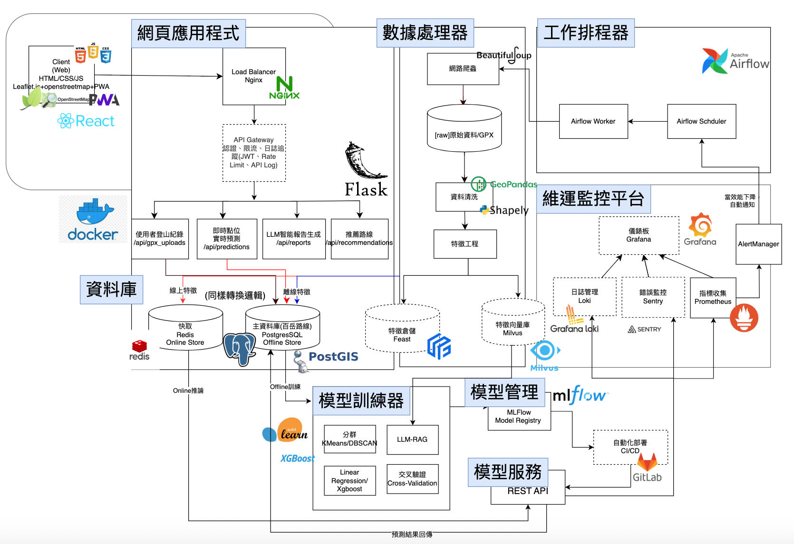
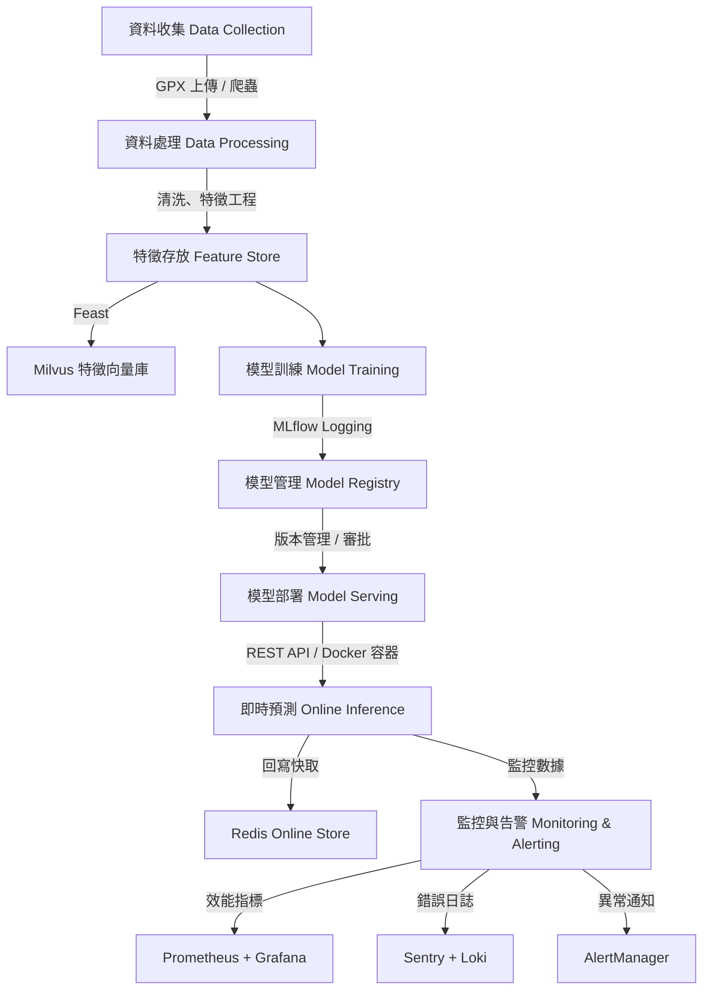

# Allpass - 登山時間預測系統 (Allpass - Hiking Time Prediction System)

本專案是一個端到端的 **AI 驅動登山時間預測平台**，結合 **前端應用、後端 API、資料庫、ETL 工作流、模型訓練與部署、監控平台**，完整實現 **模型生命週期 (ML Lifecycle)**，展示了資料科學與 AI 工程的系統整合能力。

---

## 系統架構



系統包含以下主要模組：

1. **前端應用 (Frontend Web App)**
   - 技術：React、Leaflet + OpenStreetMap、PWA
   - 功能：登山路線顯示、使用者上傳 GPX、查詢預測結果

2. **後端 API (Flask Backend)**
   - 技術：Flask + SQLAlchemy + Nginx (API Gateway)
   - 功能：
     - `/api/gpx_uploads`: 上傳 GPX 軌跡
     - `/api/predictions`: 即時路段時間預測
     - `/api/reports`: LLM 報告生成
     - `/api/recommendations`: 個人化路線建議
   - API Gateway 功能：JWT 驗證、Rate Limit、API Log

3. **資料庫 (Database Layer)**
   - PostgreSQL + PostGIS：地理空間資料存放 (登山路線、軌跡)
   - Redis：快取即時預測結果 (Online Store)
   - 初始化 SQL 位於 `db/init`

4. **ETL 與資料處理 (ETL Jobs & Data Processor)**
   - 技術：Airflow + BeautifulSoup + GeoPandas + Shapely
   - 功能：網路爬蟲、資料清洗、特徵工程
   - ETL 容器程式位於 `etl/`

5. **模型訓練與管理 (Model Lifecycle)**
   - 訓練 (`training/`)：支援 Scikit-learn、XGBoost、KMeans、DBSCAN
   - MLflow (`services/mlflow/`)：模型註冊、版本管理
   - 特徵庫：Feast + Milvus
   - 模型部署：REST API 容器化服務 (`aiservices/time_prediction`)

6. **維運監控平台 (MLOps Monitoring)**
   - Prometheus：指標收集
   - Grafana：儀表板
   - Loki：日誌管理
   - Sentry：錯誤追蹤
   - AlertManager：自動通知

---

## 模型生命週期 (ML Lifecycle)

專案完整實現 **從資料收集到模型服務化的生命週期**：

1. **資料收集 (Data Collection)**  
   - 爬蟲 + 使用者上傳 GPX  
   - 存放於 PostgreSQL + PostGIS  

2. **資料處理 (Data Processing)**  
   - ETL 工作流 (Airflow)  
   - 特徵工程 (GeoPandas, Shapely)  

3. **特徵存放 (Feature Store)**  
   - Feast (結構化特徵)  
   - Milvus (向量特徵，支援 LLM embedding)  

4. **模型訓練 (Model Training)**  
   - Scikit-learn, XGBoost, KMeans/DBSCAN  
   - Cross-validation  
   - Logging 至 MLflow  

5. **模型管理 (Model Management)**  
   - MLflow Model Registry  
   - GitLab CI/CD 自動化部署  

6. **模型服務 (Model Serving)**  
   - REST API 容器化 (Docker + Flask)  
   - Redis 線上快取，降低查詢延遲  

7. **監控與告警 (Monitoring & Alerting)**  
   - Prometheus + Grafana (效能指標)  
   - Loki (日誌)  
   - Sentry (錯誤監控)  
   - AlertManager (異常通知)  

### 模型生命週期流程圖 (Mermaid)



---

## 專案目錄結構
```markdown
allpass
├── aiservices        # AI 模型服務
│   ├── llm
│   ├── recommendation
│   └── time_prediction
├── backend           # Flask 後端 API
├── common            # 共用程式模組
├── db                # PostgreSQL / PostGIS 初始化
├── etl               # 資料處理 (Airflow + Jobs)
├── frontend          # React + PWA 前端
├── services          # 外部服務 (Airflow, MLflow, Prometheus...)
├── training          # 模型訓練
├── docker-compose.yml
└── README.md
```

---

## 快速啟動

### 1. 建立環境
```markdown
git clone https://github.com/your-repo/allpass.git
cd allpass
docker-compose up -d
```

### 2. 啟動服務
- 前端： http://localhost:3000  
- 後端 API： http://localhost:5000  
- MLflow： http://localhost:5001  
- Airflow： http://localhost:8080  
- Grafana： http://localhost:3001  

### 3. 測試 API
```markdown
curl -X POST http://localhost:5000/api/predictions \
     -H "Content-Type: application/json" \
     -d '{"trail_id": 123, "user_id": 456, "date": "2025-09-10"}'
```

---

## 技術棧 (Tech Stack)
- **Frontend**: React, PWA, Leaflet, Nginx  
- **Backend**: Flask, SQLAlchemy, REST API  
- **Database**: PostgreSQL + PostGIS, Redis  
- **ETL**: Airflow, GeoPandas, Shapely, BeautifulSoup  
- **ML Training**: Scikit-learn, XGBoost, KMeans, DBSCAN  
- **Model Management**: MLflow, Feast, Milvus  
- **DevOps / MLOps**: Docker, GitLab CI/CD, Prometheus, Grafana, Loki, Sentry

---

## 專案價值與應用
- **資料科學家視角**：展現從資料收集、特徵工程到模型實驗與評估的完整流程。  
- **AI 工程師視角**：落實模型服務化、快取、API Gateway 與監控，符合生產環境需求。  
- **MLOps 視角**：整合 CI/CD、自動化部署、監控告警，完整 AI 生命週期實踐。  

本專案可作為 **登山時間預測** 的應用案例，亦可擴展至 **交通預測、物流配送、運動數據分析** 等多領域。  


